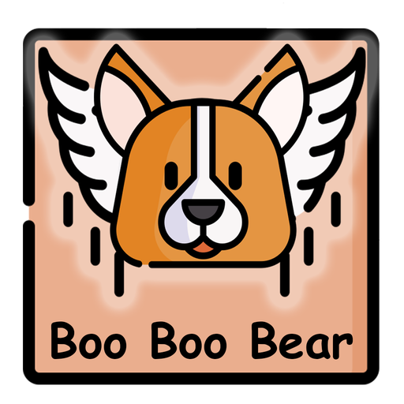

<!-- PROJECT LOGO -->
 

  

<h3 align="center">Super Pup: The Adventures of Boo Boo Bear</h3>

  

    A flappy bird inspired game dedicated to my kids and of course my dog... Boo Boo Bear.
     
     
    <a href="https://github.com/dannya1985/SuperPupAdventure/">View Demo</a>
    ·
    <a href="https://github.com/dannya1985/SuperPupAdventure/issues">Report Bug</a>
    ·
    <a href="https://github.com/dannya1985/SuperPupAdventure/issues">Request Feature</a>
  

<!-- TABLE OF CONTENTS -->

  
Table of Contents

  <ol>
    <li>
      <a href="#about-the-project">About The Project</a>
      <ul>
        <li><a href="#built-with">Built With</a></li>
      </ul>
    </li>
    <li>
      <a href="#getting-started">Getting Started</a>
      <ul>
        <li><a href="#prerequisites">Prerequisites</a></li>
      </ul>
    </li>
    <li><a href="#roadmap">Roadmap</a></li>
    <li><a href="#license">License</a></li>
    <li><a href="#contact">Contact</a></li>
    <li><a href="#acknowledgments">Acknowledgments</a></li>
  </ol>

<!-- ABOUT THE PROJECT -->
## About The Project

[![Product Screen Shot][product-screenshot]](https://.com)

TODO: About summary and check in screenshot of game.

(<a href="#readme-top">back to top</a>)

### Built With
* [![Unity][Unity.com]][Unity-url]
* [![C#][CSharp.com]][CSharp-url]

(<a href="#readme-top">back to top</a>)

<!-- GETTING STARTED -->
## Getting Started

### Prerequisites
Unity 2021.3.7f1 or newer

### Installation
Download the project zip and extract it to the desired destination, then using the unity hub app open the unzipped folder. Unity will take some time to resolve packages and figure things out, but it'll open the project as expected.

(<a href="#readme-top">back to top</a>)

<!-- ROADMAP -->
## Roadmap
- [ ] Additional Power-ups
- [ ] Additional levels
- [ ] Mini-game addition
- [ ] Choose your pet - BooBoo Bear's sidekicks
    - [ ] Scrappy Dog

See the [open issues](https://github.com/dannya1985/SuperPupAdventure/issues) for a full list of proposed features (and known issues).

(<a href="#readme-top">back to top</a>)

<!-- LICENSE -->
## License

Distributed under the MIT License. See `LICENSE.txt` for more information.

(<a href="#readme-top">back to top</a>)

<!-- CONTACT -->
## Contact

Dan Amos - [@twitter](https://twitter.com/RoflSausages) - [Email](mailto:74069711+dannya1985@users.noreply.github.com)

Project Link: [https://github.com/dannya1985/SuperPupAdventure](https://github.com/dannya1985/SuperPupAdventure)

(<a href="#readme-top">back to top</a>)

<!-- MARKDOWN LINKS & IMAGES -->
<!-- https://www.markdownguide.org/basic-syntax/#reference-style-links -->
[contributors-shield]: https://img.shields.io/github/contributors/github_username/repo_name.svg?style=for-the-badge
[contributors-url]: https://github.com/github_username/repo_name/graphs/contributors
[forks-shield]: https://img.shields.io/github/forks/github_username/repo_name.svg?style=for-the-badge
[forks-url]: https://github.com/github_username/repo_name/network/members
[stars-shield]: https://img.shields.io/github/stars/github_username/repo_name.svg?style=for-the-badge
[stars-url]: https://github.com/github_username/repo_name/stargazers
[issues-shield]: https://img.shields.io/github/issues/github_username/repo_name.svg?style=for-the-badge
[issues-url]: https://github.com/github_username/repo_name/issues
[license-shield]: https://img.shields.io/github/license/github_username/repo_name.svg?style=for-the-badge
[license-url]: https://github.com/github_username/repo_name/blob/master/LICENSE.txt
[linkedin-shield]: https://img.shields.io/badge/-LinkedIn-black.svg?style=for-the-badge&logo=linkedin&colorB=555
[linkedin-url]: https://linkedin.com/in/linkedin_username
[product-screenshot]: images/screenshot.png
[Csharp.com]: https://img.shields.io/badge/c%23-%23239120.svg?style=for-the-badge&logo=c-sharp&logoColor=white
[Csharp-url]: https://docs.microsoft.com/en-us/dotnet/csharp/
[Unity.com]: https://img.shields.io/badge/Unity-000000?style=for-the-badge&logo=unity&logoColor=white
[Unity-url]: https://jquery.com 
